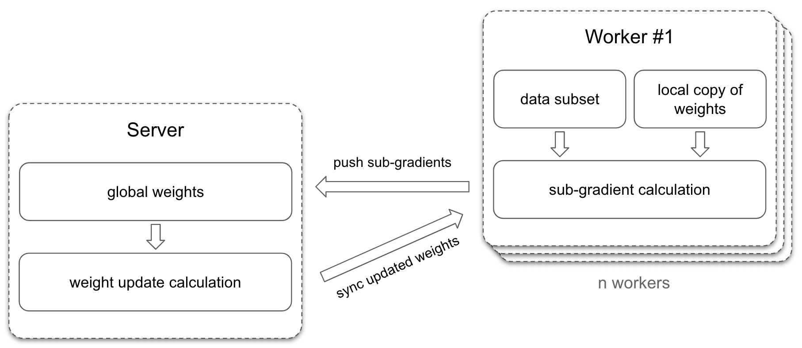
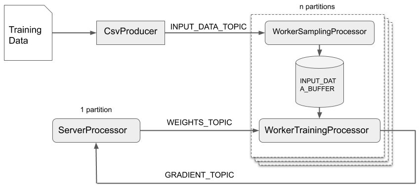
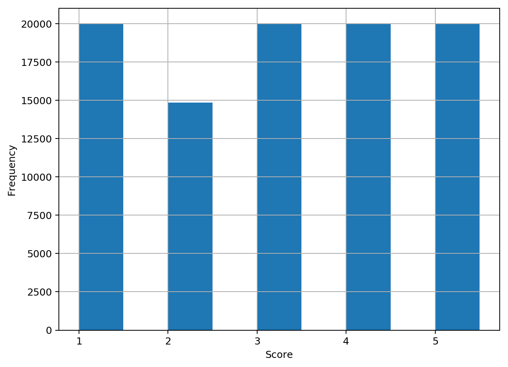
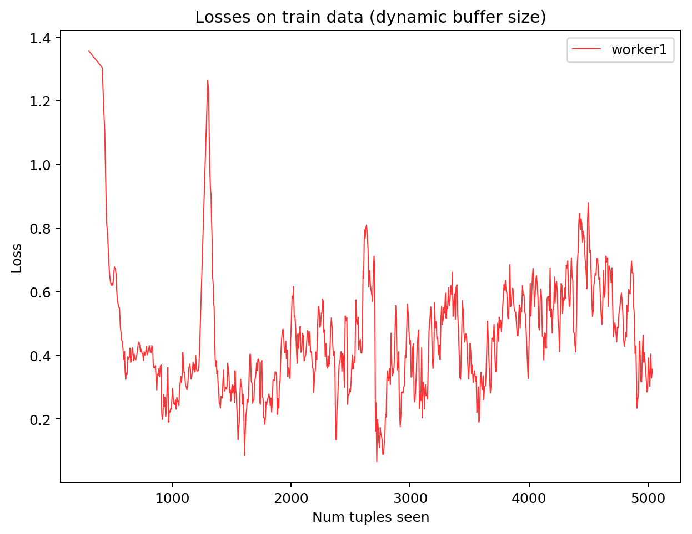
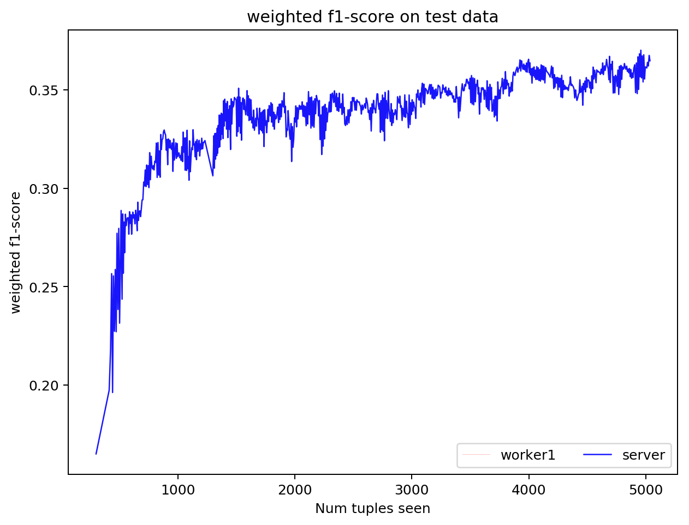

# Parameter Server on Apache Kafka

## 1 Abstract
The parameter server architecture is a commonly used approach to synchronize workers during distributed machine learning (ML) tasks.
We adapted this architecture to our needs and implemented it using Apache Kafka's streams platform.  
[TODO: What will be explained/ evaluated in the following sections?]

## 2 Getting Started

### Prerequisites
If you want to execute our implementation locally please ensure you have installed the following prerequisites in the right versions:
1. Gradle in a version > 5.0 (To install Gradle please follow the official instructions: <https://gradle.org/install/>)
2. Docker (To install Docker please follow the official instructions: <https://www.docker.com/products/docker-desktop>)

### Clone the Repository
```$bash
git clone git@github.com:mschroederi/Parameter-Server-Architecture-On-Apache-Kafka.git
cd ./Parameter-Server-Architecture-On-Apache-Kafka
```

### Build & Run Locally
Please make sure you fulfill the prerequisites defined above. 
If you do so you can continue with the following steps:  
1. _(Optionally)_ If you haven't done it yet, make sure you navigate into the project's root folder.
2. Build the project using Gradle `gadle build`
3. Open a new terminal window within the current location and execute `cd ./dev && docker-compose up`
4. In a new terminal at the current location execute first `chmod u+x run.sh` and then `./run.sh`.

Congratulations, you started the parameter server on Apache Kafka and are now training a logistic regression with one of our sample datasets. 🎉  

In order to tear down the kafka setup completely please execute `cd ./dev && docker-compose down -v`.

## 3 Motivation
Machine learning algorithms nowadays build up an integral part of products used by billions of users every day.
These algorithms need to be trained on a regular basis to keep them up-to-date which usually involves training on huge amounts of data on highly distributed systems.
One of the architectures that enabled such distributed training is called parameter server.
It evolved to be a commonly used way to perform data parallel model training.
Big ML frameworks like TensorFlow used it for many years.
In recent years, update-cycles of machine learning algorithms got smaller and smaller, resulting in real-time model optimization.
We present an implementation of the parameter server on the streaming framework Apache Kafka which enables users to train their models in real-time.

## 4 Related Work
There are many systems out there implementing different versions of the parameter server model.
We mainly focus on their third generation which proposes many different optimizations compared to the previous versions [1].
Google presented TensorFlow in 2016 showing how the static approach of the parameter server architecture can be improved to be way more flexible by not assuming some nodes as servers and others as workers, but letting different tasks on different nodes take over the classical role of the parameter server [2].
However, some systems like MXNet still rely on the classical parameter server approach to scale training across different nodes [4].
Moreover, there are approaches on how to implement parameter servers on heterogeneous clusters [3].

## 5 Architecture

### 5.1 Parameter Server Concept
The parameter server architecture can be split into two groups of nodes. 
On the one hand server nodes and on the other hand worker nodes.



Each worker node holds a distinct subset of the training data and a copy of the ML model's weights.
The local subset of the data is then used to train the local copy of the model.
As we want to make sure the individual workers' models to not drift apart too much, the workers are synchronized on a regular basis.
In order to understand how this is done lets first have a look at a training epoch in general.
A training epoch consists of two steps that need to be executed sequentially. 
First, the current model predicts the outcome on the local training data. 
The gradient is then calculated by using an error function that describes the difference between the prediction and the expected outcome.
In the second step, new weights are calculated based on the previously determined gradient.
A synchronization between the worker nodes can be achieved by combining all workers' gradients in order to calculate a weight update.
This is the server node responsible for. It sums up all sub-gradients the workers calculated on their local data subset and determines new weight for the next training iteration on a global level.
These new weights are then pushed to all worker so they can start their new training epoch.

### 5.2 Implementation on Apache Kafka
In Kafka one can use partitions to distribute tasks onto different nodes. 
Our implementation uses a single partition on the server side and (theoretically) arbitrary many partitions on the worker side.
As a consequence all workers send calculated sub-gradients to a single server instance, 
whereas the server needs to send weight updates to all the different partitions.
The general parameter server architecture also distributes the server onto different nodes, 
but we identified this as unnecessary overhead in order to fulfill the simple logistic regression task our implementation is optimized for.
In general, we implemented the server as well as the worker as Kafka processors, but split each worker into two separate processors (WorkerSamplingProcessor and WorkerTrainingProcessor).
Whereas the _WorkerSamplingProcessor_ is responsible for managing the local data subsets the _WorkerTrainingProcessor_ is responsible for calculating the sub-gradients based on the data the _WorkerSamplingProcessor_ provides.



#### CsvProducer
To simulate a real-world scenario where new training data is coming in on a regular basis we implemented a the _CsvProducer_.
It is a single Kafka producer that reads in a CSV file and sends the data via the _INPUT_DATA_TOPIC_ to the worker nodes.
As a result the _INPUT_DATA_TOPIC_ has as many partitions as the system has number of workers.
By using round robin as the partitioning strategy we assure that all worker nodes get equally many training data samples.
Our setup requires a CSV file that contains encoded data, i.e. all features in the training data must be of numerical data type.
The workers do not encode the data before using them for training.

#### WorkerSamplingProcessor
As mentioned above the _WorkerSamplingProcessor_ is one of two processors that take over the workers' tasks.
This one subscribes to the _INPUT_DATA_TOPIC_ to receive new training data and store them in a state store called _INPUT_DATA_BUFFER_.
The buffer then contains the training data for the next training iteration of the worker.
We had two requirements for the buffer. 
First, it should support (theoretically) arbitrary large buffer sizes and second, it should dynamically adjust to the speed new training data comes in with as first tests indicated that the buffer size was critical to prevent under- and overfitting of the trained logistic regression model.
In order to support those requirements the _WorkerSamplingProcessor_ reserves a key range in the _INPUT_DATA_BUFFER_ that could potentially fit the maximum allowed buffer size.
At each of these keys we might store a single data tuple.
The following procedure allows us to make sure the most recent training tuples are kept in the buffer while increasing, decreasing or keeping the buffer size as it is.
Depending on the frequency new training data tuples are received we calculate a `targetBufferSize` which is a best guess of the optimal buffer size.  
I. If the current buffer size is smaller than the `targetBufferSize`, we start assigning new training data tuples to yet empty keys.  
II. If the current buffer size is equal to the `targetBufferSize`, we replace the oldest training data tuples with the newly received one.  
III. If the current buffer size is larger than the `targetBufferSize`, we start deleting the oldest data tuples until we reach the `targetBufferSize` and similar to II replace the then oldest training data tuple with the new one.  

#### WorkerTrainingProcessor
Whereas the _WorkerSamplingProcessor_ is responsible for collecting new training data, the _WorkerTrainingProcessor_ computes gradients to submit them to the _ServerProcessor_.
After receiving a weight update via the _WEIGHTS_TOPIC_ this processor is subscribed to it starts calculating the gradients based on the current training data in the _INPUT_DATA_BUFFER_ state store.
In order to do so, the _WorkerTrainingProcessor_ uses a logistic regression implementation in Spark's ML library.
After the model's local copy was trained for one iteration the gradients are extracted and send to the _ServerProcessor_ via the topic called _GRADIENT_TOPIC_.
The next training iteration starts as soon as the _WorkerTrainingProcessor_ receives another weight update on the topic _WEIGHTS_TOPIC_.

#### ServerProcessor
The _ServerProcessor_ takes over the role of the central coordination and synchronization unit between all the worker nodes.
It is subscribed to the _GRADIENT_TOPIC_ and answers each of this messages asynchronously on the _WEIGHTS_TOPIC_.
This enabled us to implement a training loop between the server and worker nodes.
Everything starts with a message on the _WEIGHTS_TOPIC_ containing the ML model's initial weights.
All sub-gradients that are received on the _GRADIENT_TOPIC_ topic are processed right away, but potentially answered at a later point in time based on the chosen consistency models (please see below).
Once the consistency model tells us to combine the collected sub-gradients, the _ServerProcessor_ calculated new weights and sends them to those workers that are still waiting for a response containing updated weights.
The sub-gradients are combined by simply adding them up with respect to a certain learning rate.


### 5.3 Consistency Models
The Parameter Server provides three consistency models:
- Sequential Consistency
- Eventual Consistency
- Bounded Delay  

The consistency model specifies how, and when, the different sub-gradients from the workers get combined to update the weights on the server.
The three models form an order of strictness: Eventual Consistency is loose, Bounded Delay is medium, and Sequential Consistency is strict.  
In the code, the consistency model is defined by the variable `maxVectorClockDelay` (in `ServerProcessor`).

#### Sequential Consistency
The server waits until it receives all sub-gradients of a specific iteration from the workers. Then it combines the sub-gradients and updates the weights.
Once the worker receive the updated weights, they can continue with the next iteration (in the meantime, they are idle).
All worker are always in the same iteration.

This model is prone to the straggler problem.

To use this model, set `maxVectorClockDelay` to `0`.

#### Eventual Consistency
The server updates the weights as soon as it receives sub-gradients from a worker. The new weights are only pushed to the worker which caused the update.
The other worker continue calculating with their 'old' weights until they finish their iteration. 
Workers can be in different iterations.

This model is not prone to the straggler problem because workers do not need to wait for other workers. 
However, some workers might be many iterations ahead of other worker, which might be undesirable.

To use this model, set `maxVectorClockDelay` to `MAX_DELAY_INFINITY` (this is a constant for `-1`).

#### Bounded Delay
This model is a trade-off between the previous two consistency models. Similar to the Eventual Consistency model, workers can be in different iteration.
However, The difference between the furthest and the slowest worker must never exceed the threshold of `maxVectorClockDelay`.
If the gap between the furthest and the slowest worker gets too big, the furthest worker has to wait until the gap is lower than the threshold again.

This model can be used to simulate the other two consistency models.

To use this model, set `maxVectorClockDelay` to an number >0. This variable is the maximum allowed gap between the furthest and the slowest worker.


## 6 Evaluation
- time
- model performance

### The Dataset
We use Amazon's fine food reviews dataset as the basis for the evaluation of our implementation [5].
During the preparation we used a hash vectorizer with 1024 features to vectorize the review texts.
The ML task is a logistic regression where we want to predict the score the users assigned to their reviews.
As a conclusion the dataset contains five different labels.
In the original dataset the labels had a strong bias, as the label `5` occurred way more often than the other labels.
We decided to remove reviews until we have a maximum of 20,000 tuples per label.
The final result can be seen below.



### Ground Truth Algorithm
Using a python logistic regression implementation [6] we achieved the following result on the test dataset.

|              | precision | recall | f1-score | support |
|--------------|-----------|--------|----------|---------|
| 1            | 0.55      | 0.62   | 0.58     | 1038    |
| 2            | 0.38      | 0.29   | 0.33     | 741     |
| 3            | 0.43      | 0.48   | 0.46     | 1041    |
| 4            | 0.39      | 0.50   | 0.44     | 1024    |
| 5            | 0.60      | 0.41   | 0.49     | 1033    |
|              |           |        |          |         |
| micro avg    | 0.47      | 0.47   | 0.47     | 4877    |
| macro avg    | 0.47      | 0.46   | 0.46     | 4877    |
| weighted avg | 0.48      | 0.47   | 0.47     | 4877    |

We expect the result of our streaming application to be worse because we are only capable of looking at a limited number of tuples at each time point and thereby slowly 'forget' tuples that appeared in the past.

### Parameter Server using a Single Worker
We want to compare how the trained models perform with respect to the number of workers they were trained on.
Therefore, our evaluation will start with a single worker.

| parameter         | value | description                                                               |
|-------------------|-------|---------------------------------------------------------------------------|
| numWorkers        | 1     | The number of workers (i.e. partitions) the application was executed with |
| events per second | 2     | Event frequency the CSVProcuder sent tuples to the INPUT_DATA_TOPIC       |

How the loss on the training data evolved can be seen below.
There, one can clearly see that the our application was able to optimize its parameters to fit the training data quite nicely up to the point where it received more than 1,000 tuples.
After that the loss increases quickly.
This is caused by a training data distribution that changes over time.
Moreover, we evaluated the model with an event frequency of 5 tuples per second. 
This results in a very fast exchange of tuples in the training data buffer.
There's not much time for the model to fit its parameters to the new data.


The more meaningful plot is the one shown below.
It displays the f1 score on the training data over time.
As the test data does not change with the number of iteration we can compare the model performance over time here.
By doing so we can conclude that the model constantly improves over time.
Because the model has only seen the first ~5,000 tuples of the dataset when we stopped the evaluation we also expect the result to be a little worse than the ground truth example above where the model was capable of scanning through the training data multiple times.



### Event Frequency

### Consistency Models


## 7 Conclusion & Future Work

## References
[1] Li, Mu, et al. "Scaling distributed machine learning with the parameter server." 11th USENIX Symposium on Operating Systems Design and Implementation (OSDI 14). 2014.

[2] Abadi, Martín, et al. "Tensorflow: A system for large-scale machine learning." 12th USENIX Symposium on Operating Systems Design and Implementation (OSDI 16). 2016.

[3] Jiang, Jiawei, et al. "Heterogeneity-aware distributed parameter servers." Proceedings of the 2017 ACM International Conference on Management of Data (SIGMOD ’17). 2017.

[4]  T. Chen, M. Li, Y. Li, M. Lin, N. Wang, M. Wang, T. Xiao, B. Xu, C. Zhang, and Z. Zhang. MXNet: A flexible and efficient machine learning library for heterogeneous distributed systems. In Proceedings of LearningSys, 2015. <https://www.cs.cmu.edu/~muli/file/mxnet-learning-sys.pdf>.

[5] Stanford Network Analysis Project. _Amazon Fine Food Reviews_ *URL:* <https://www.kaggle.com/snap/amazon-fine-food-reviews>

[6] Amazon DataWig <https://github.com/awslabs/datawig>